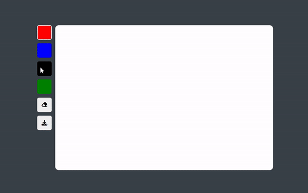

# paint-app        


## 기능 
그림판  

1. 원하는 색상을 클릭하여 펜으로 사용
2. 지우개
3. 그림을 이미지로 저장하기   

## 학습 
### 1. JS : Canvas API   
Canvas API는 JavaScript와 HTML `<canvas>` 엘리먼트를 통해 그래픽을 그리기위한 수단을 제공    
```
<canvas id="canvas"></canvas>
```
```
const canvas = document.getElementById("canvas"); // (1)
const ctx = canvas.getContext("2d"); // (2)

ctx.fillStyle = "green"; // (3)
ctx.fillRect(10, 10, 150, 100); // (3)
```

(1) Document.getElementById() 메소드는 HTML <canvas> 엘리먼트에 대한 참조를 얻습니다.
(2) HTMLCanvasElement.getContext() 메소드는 엘리먼트의 컨텍스트(렌더링될 그리기의 대상)를 얻습니다.

(3) fillStyle 프로퍼티는 사각형을 초록색으로 만듭니다. fillRect() 메소드는 좌측 상단 코너를 (10, 10) 위치에 놓으며, 너비를 150, 높이를 100으로 지정합니다.


## 학습 출처   
**유튜브**   
https://www.youtube.com/@sucoding    

**아이콘**   
https://www.iconfinder.com/

**캔버스 API 이해하기**   
https://developer.mozilla.org/ko/docs/Web/API/Canvas_API